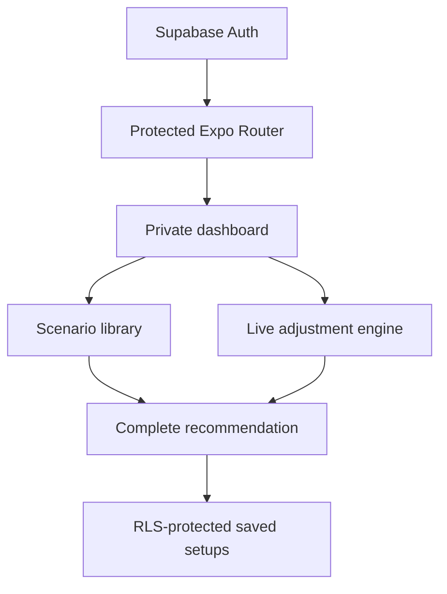

# FramePilot

I built FramePilot as a cross-platform field assistant for photographers who need a complete, reasoned camera setup rather than three isolated exposure values. The same Expo/React Native codebase runs on iOS and Android, and the private dashboard is available only after sign-in or an explicit demo session.

FramePilot starts with the photograph—portrait, wildlife, sport, landscape, macro, astrophotography, street, event, commercial, creative, or video—and then adapts the recommendation to the real light, subject movement, creative intent, sensor format, focal length, maximum aperture, stabilisation, handheld/tripod use, flash availability, and intended output.

## What I implemented

- Email/password account creation, sign-in, sign-out, and protected navigation
- Supabase Auth integration through its client-safe REST endpoints
- A useful demo mode when a backend has not yet been configured
- A private dashboard with the current field setup, gear profile, quick scenarios, and saved-setup count
- 26 field scenarios covering people, action, nature, low light, travel, creative work, commercial photography, and video
- A recommendation engine that derives shutter speed from subject motion, focal length, crop factor, stabilisation, and creative intent
- ISO estimation from aperture, shutter time, and approximate scene EV, with an output-quality-aware ceiling
- Lens-aware aperture recommendations that never request an aperture wider than the configured lens can provide
- Full-frame, APS-C, Micro Four Thirds, and 1-inch sensor support
- Cloud-synchronised saved setups protected by PostgreSQL row-level security
- A responsive dark interface designed for quick reading in the field
- Accessibility labels, selected states, readable contrast, and tablet-width layouts
- Unit tests for scenario integrity, action shutter speed, ISO ceilings, long exposures, and video output

## Parameters covered

The output deliberately goes beyond aperture, shutter, and ISO:

| Group | Included decisions |
|---|---|
| Exposure | Mode, aperture, shutter range, ISO estimate/range, compensation, metering, histogram, zebras, bracketing |
| Autofocus | AF mode, area, tracking, subject/eye detection, focus priority, limiter, pre-capture |
| Capture | Single/burst/timer, shutter type, electronic front curtain, buffer strategy, anti-flicker |
| Colour and files | White balance, Kelvin/custom reference, RAW compression, bit depth, JPEG/HEIF, colour space, creative look |
| Lens and support | Focal range, crop factor, stabilisation mode, tripod behaviour, filters, corrections, diffraction |
| Lighting | Ambient balance, TTL/manual flash, HSS/native sync, compensation, bounce, diffusion, continuous light |
| Image quality | High-ISO NR, long-exposure NR, highlight protection, dual-card backup |
| Video | Frame rate, 180-degree shutter, profile/log, bit depth, ND, autofocus transition, audio and monitoring |
| Field readiness | Batteries, card capacity, weather, condensation, lens checks, subject welfare, first-frame verification |

## Scenario coverage

- Daylight, low-light, and environmental portrait
- Wedding and event photography
- Perched wildlife, birds in flight, pets, and insect macro
- Outdoor sport, indoor sport, and panning
- Landscape, waterfall/long exposure, architecture, and interiors
- Static macro, food, and product photography
- Day and night street photography
- Concert and stage photography
- Milky Way, moon, fireworks, snow, and beach scenes
- Cinematic interview and slow-motion action video

Every recommendation remains a starting point. The interface explains *why* each parameter was selected and reminds the photographer to verify the histogram, highlight channels, and focus using the actual scene.

## Architecture



| Layer | Implementation |
|---|---|
| Mobile UI | React Native 0.86 and Expo SDK 57 |
| Navigation | Expo Router protected routes and tabs |
| Language | Strict TypeScript |
| Authentication | Supabase Auth REST API |
| Persistence | Supabase/PostgreSQL with row-level security |
| Domain logic | Pure, testable TypeScript recommendation engine |
| Platforms | iOS 16.4+, Android 7+, and an optional static web build |

The recommendation engine is independent of the screen components. This keeps the photography logic testable and allows a future camera-control integration or watch companion to reuse the same decisions.

## Run locally

Requirements: Node.js 22.13 or newer and Expo Go, an iOS simulator, or an Android emulator.

```bash
npm install
cp .env.example .env
npm start
```

Use `i` for the iOS simulator, `a` for Android, or scan the Expo QR code. Demo mode works without configuring Supabase.

## Configure real accounts and cloud saves

1. Create a Supabase project.
2. Run [`supabase/schema.sql`](supabase/schema.sql) in its SQL editor.
3. Copy `.env.example` to `.env`.
4. Add the project URL and **publishable** client key.
5. Configure the preferred email confirmation and redirect settings in Supabase Auth.

I never include a service-role key in the application. Saved setups include `user_id`, and the included RLS policies limit every select, insert, update, and delete operation to `auth.uid() = user_id`.

## Validation

```bash
npm run validate
npx expo export --platform web
```

The validation command runs strict TypeScript checks, the recommendation-engine tests, and a production web export of the shared React Native interface.

## Current scope

This repository contains a complete source implementation, backend schema, and build configuration; it is not a claim that binaries have already been submitted to the App Store or Google Play. Authentication tokens intentionally remain in memory for the current app session rather than being written to unencrypted storage. A production release can add a platform-secure persistence adapter, camera-brand control integrations, localisation, weather/light-meter data, and calibrated camera/lens profiles after their permissions and privacy implications are reviewed.

## Licence

MIT © 2026 Sina Afshar
